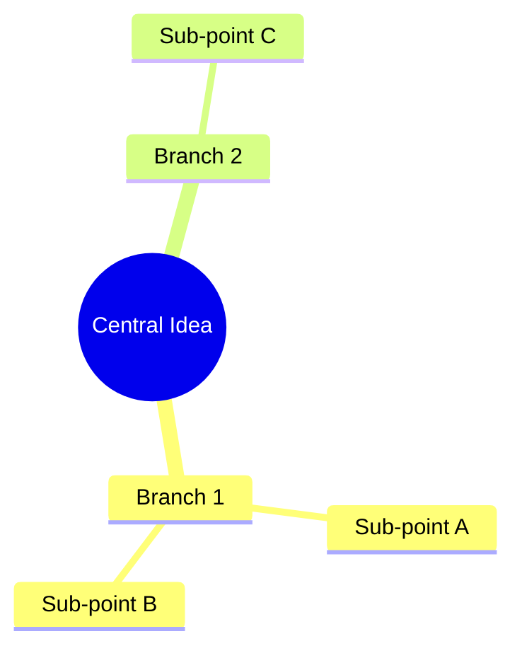

# Vault Note Style Guide (Visual PKM Standard)

All markdown documents, notes, research summaries, and Maps of Content (MOCs) created or modified in the Obsidian vault must adhere to the **Visual PKM / Digital Garden Dashboard** standard.

---

## 1. Document Structure & YAML Frontmatter
Every note must begin with clean YAML frontmatter:
```yaml
---
title: <Document Title>
aliases: [<Alternative Name>, <Acronym>]
tags:
  - <tag1>
  - <tag2>
date created: YYYY-MM-DD HH:MM:SS
date modified: YYYY-MM-DD HH:MM:SS
---
```

## 2. The Executive Callout Box
Directly beneath the `# <Title>` header, include an Obsidian Callout block (`[!ABSTRACT]`, `[!NOTE]`, `[!TIP]`, etc.) summarizing the note's core premise, thesis, or vibe in 1–2 sentences:
```markdown
# 🪐 Document Title

> [!ABSTRACT] Executive Summary
> High-level summary capturing the core premise and essential context.
```

## 3. Thematic Iconography & Section Anchors
Use thematic emojis as visual landmarks in headers (e.g. 🪐, 🏜️, 🕯️, ⚡, 🏛️, 📊, 🎧, 🧭).
- Headers should be scannable at a glance without wall-of-text fatigue.
- Separate major conceptual sections with horizontal rules (`---`).

## 4. Diagrammatic Synthesis (Mermaid Charts)
When conceptualizing relationships, taxonomies, workflows, or dual-state dynamics, include a clean Mermaid chart (`mindmap`, `graph TD`, `graph LR`):
````markdown

````

## 5. Comparative Tables & High Data Density
Organize lists of items, tracks, resources, comparisons, or tools into structured markdown tables:
- Standardize metadata columns (e.g., `| # | Name | Category | Characteristics | Description |`).
- Escape any pipe characters (`|`) in cell text to preserve markdown table integrity.

## 6. Bi-directional WikiLinking (`[[...]]`)
- Deeply interconnect concepts by linking to parent Maps of Content (MOCs), sibling topics, and referenced entities (`[[WikiLink]]` or `[[TargetNote|Display Name]]`).
- Always conclude notes with a `## 🔗 Related Notes` section linking to parent MOCs and related concepts.
