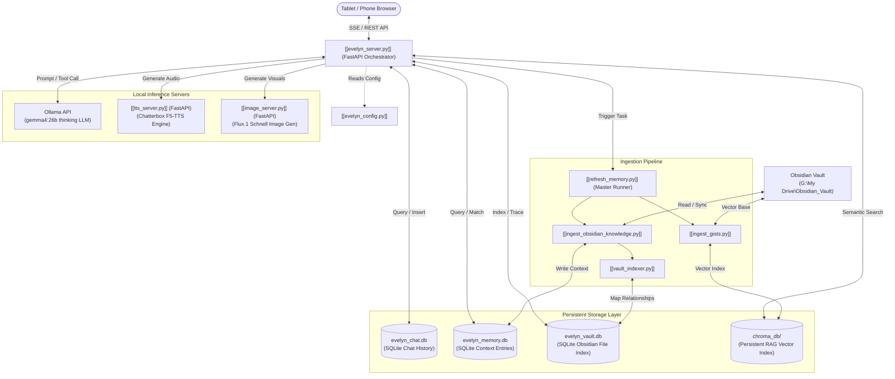

# Evelyn Engine Architecture Map

This document serves as the master structural blueprint of the **Evelyn Engine** ecosystem. It maps every core script, database component, and background service to its functional layer, creating a fully connected knowledge hub for both humans and AI agents.

---

## 1. System Ecosystem & Data Flow

The following Mermaid diagram visualizes the interactive data flow between the user interface, the central FastAPI server, our specialized storage layers, and local AI engines.

---

## 2. Core Functional Layers

### 2.1 The Orchestrator
The runtime core that manages user connections, model prompts, memory assembly, and active tool routing.
* **[[evelyn_server.py]]**: Main FastAPI server codebase. Contains SSE endpoint streams, historical retrieval limits, thread-break marks, and endpoints for system tools.
* **[[evelyn_config.py]]**: Single source of truth config file. Controls LLM parameters, on-demand memory thresholds, allowed Tailscale CORS origins, and system path settings.

### 2.2 Memory & RAG Retrieval Engine
Responsible for semantic vector indexing, context fact assemblies, and exact entity resolutions.
* **[[memory_db.py]]**: SQLite database connector for `evelyn_memory.db`. Manages transactions for context entries.
* **[[vault_db.py]]**: SQLite database connector for `evelyn_vault.db`. Handles super-fast incremental metadata writes for mapped files.
* **[[chroma_rag.py]]**: ChromaDB semantic search vector index wrapper. Performs vector assembly and distance scoring.
* **[[context_manager.py]]**: Mismatch resolver and active context injector. Assembles dense facts, resolves entities, and strips search bloat.
* **[[query_reformulator.py]]**: Sub-pipeline LLM trigger that optimizes conversational keywords before vector lookup, boosting hit rates by 23%.

### 2.3 The Ingestion Pipeline
Initiated on-demand to rebuild, map, and synchronize files from your Obsidian Vault into the local RAG database.
* **[[refresh_memory.py]]**: Master synchronous process orchestrator. SEQUENTIALLY triggers:
  1. Vault Mapping (`VaultIndexer`)
  2. Knowledge Sync (`ingest_obsidian_knowledge`)
  3. Gist Sync (`ingest_gists`)
* **[[ingest_obsidian_knowledge.py]]**: Imports psychological blueprints, relationship taxons, and narrative files into memory.
* **[[ingest_gists.py]]**: Parses vault markdown files, strips YAML bloat, generates dense summarizing gists, and uploads them to Chroma DB.
* **[[vault_indexer.py]]**: Scans directory tree files and generates incremental database relationships (hashes, links, backlinks) inside SQLite.

### 2.4 Active Runtime Agents & Tools
Standalone background processes and tools loaded dynamically by the model during chat execution.
* **[[evelyn_tools.py]]**: Definitive tool definitions library (e.g., DuckDuckGo `search_web`, `write_journal_entry`, `recall_specific_memory`).
* **[[fact_extractor.py]]**: Idle-time fact scanner. Audits chat history for fresh assertions and stages them to memory.
* **[[fact_consolidator.py]]**: Idle-time database cleaner. Scans context databases for duplicate or superseded facts.
* **[[pending_reviewer.py]]**: CLI dashboard helper for consolidating or deleting staged facts.
* **[[context_reviewer.py]]**: CLI dashboard helper for viewing active context queues.
* **[[undo_thread.py]]**: Interactive debugging script to safely rollback transactions in memory files.

### 2.5 Standalone Inference Services
FastAPI services running locally to isolate heavy GPU model weights and guarantee zero VRAM resource leakage when idle.
* **[[tts_server.py]]**: Chatterbox (F5-TTS/Matcha) server generating natural expressive speech.
* **[[image_server.py]]**: FLUX.1 [schnell] server with lazy-loading auto-eviction.

### 2.6 The Frontend User Interface
The presentation and interaction layout loaded by the client browser. Connects directly to server APIs for state management and model inference.
* **`evelyn_ui/index.html`**: The main user-facing dashboard. Renders the interactive companion panel, maintains Tailscale CORS setups, triggers dynamic TTS playback, and drives background task polling.
  * *API Bridges*: Communicates via [[endpoints.md#1-chat--conversation-management]] (for streaming prompts), [[endpoints.md#2-ingestion--background-task-orchestration]] (for memory refreshes), and [[endpoints.md#3-local-inference-bridges]] (for speech generation).
* **`evelyn_ui/dev.html`**: The developer and review dashboard console. Displays a visual triaging interface for reviewing staged observations and consolidation proposals.
  * *API Bridges*: Communicates via [[endpoints.md#5-developer--review-queue-apis-interactive-triaging]] (to approve, reject, or merge memories).

---

## 3. Maintenance & Workflow Directives

Evelyn Engine operations are codified inside interactive workflow files:
* **[[start-services.md]]**: Sequential startup steps (Ollama TCP gate → Parallel microservices).
* **[[backup-to-github.md]]**: Protective Git pipeline to keep local personal context files private.
* **[[quality-review.md]]**: Structured engineering checklist to audit and protect system code loops.
* **[[debug-chat-db.md]]**: Inspecting chat history logs and troubleshooting SQLite events.
* **[[update_frontmatter.py]]**: Structural metadata utility running automatically on document edits.
* **[[add_titles.py]]**: Retroactive title block scanner.
* **[[benchmark_rag.py]]**: Diagnostic pipeline query testing framework.
