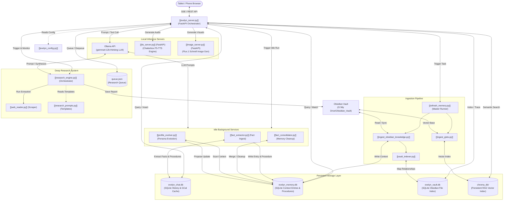

# Evelyn Engine Architecture Map

This document serves as the master structural blueprint of the **Evelyn Engine** ecosystem. It maps every core script, database component, and background service to its functional layer, creating a fully connected knowledge hub for both humans and AI agents.

---

## 1. System Ecosystem & Data Flow

The following Mermaid diagram visualizes the interactive data flow between the user interface, the central FastAPI server, our specialized storage layers, and local AI engines.



---

## 2. Core Functional Layers

### 2.1 The Orchestrator
The runtime core that manages user connections, model prompts, memory assembly, and active tool routing.
* **[[evelyn_server.py]]**: Main FastAPI server codebase. Contains SSE endpoint streams, historical retrieval limits, thread-break marks, and endpoints for system tools. Implements a multi-round **agentic tool loop** (`call_ollama_full` with `think: cfg.THINK_TOOL_LOOP`) that allows the model to reason at each decision point — evaluating tool results and deciding whether to call another tool or exit — before streaming the final response. Intermediate per-round reasoning can optionally be forwarded to the client as SSE thinking events (`SHOW_TOOL_LOOP_THINKING`). Loop rounds use a configurable smaller token budget (`TOOL_LOOP_NUM_PREDICT`) distinct from the full response budget.
* **[[evelyn_config.py]]**: Single source of truth config file. Controls LLM parameters, on-demand memory thresholds, allowed Tailscale CORS origins, and system path settings. Key agentic parameters: `THINK_TOOL_LOOP` (enable reasoning in tool rounds), `TOOL_LOOP_NUM_PREDICT` (per-round token budget), `SHOW_TOOL_LOOP_THINKING` (surface intermediate reasoning to UI), `MAX_TOOL_ROUNDS` (loop cap).

### 2.2 Memory & RAG Retrieval Engine
Responsible for semantic vector indexing, context fact assemblies, and exact entity resolutions.
* **[[memory_db.py]]**: SQLite database connector for `evelyn_memory.db`. Manages transactions for context entries and procedural rules.
* **[[vault_db.py]]**: SQLite database connector for `evelyn_vault.db`. Handles super-fast incremental metadata writes for mapped files.
* **[[chroma_rag.py]]**: ChromaDB semantic search vector index wrapper. Performs vector assembly, distance scoring, and dynamic keyword-triggered procedure injection.
* **[[context_manager.py]]**: Mismatch resolver and active context injector. Assembles dense facts, resolves entities, and strips search bloat.
* **[[context_summarizer.py]]**: Sliding-window context compressor. Summarizes older context/messages and updates the rolling history boundary to keep LLM prompts thin.
* **[[query_reformulator.py]]**: Sub-pipeline LLM trigger that optimizes conversational keywords before vector lookup, boosting hit rates by 23%.

### 2.3 The Ingestion Pipeline
Initiated on-demand to rebuild, map, and synchronize files from your Obsidian Vault into the local RAG database.
* **[[refresh_memory.py]]**: Master synchronous process orchestrator. SEQUENTIALLY triggers:
  1. Vault Mapping (`VaultIndexer`)
  2. Knowledge Sync (`ingest_obsidian_knowledge`)
  3. Gist Sync (`ingest_gists`)
* **[[ingest_obsidian_knowledge.py]]**: Imports psychological blueprints, relationship taxons, and narrative files into memory.
* **[[ingest_gists.py]]**: Parses vault markdown files, strips YAML bloat, generates dense summarizing gists, and uploads them to Chroma DB.
* **[[vault_indexer.py]]**: Scans directory tree files and generates incremental database relationships (hashes, links, backlinks) inside SQLite.

### 2.4 Deep Research Subsystem
Enables fully autonomous, multi-step search and information synthesis in the background when the server is idle.
* **[[research_engine.py]]**: Core deep research runner. Manages state transitions, confidence scoring, safety brakes, Obsidian Vault compilation, self-initiated gap extraction, auto-rewriting of low-confidence questions, post-synthesis triage loops, local Obsidian note parsing, per-task Chroma vector indexing (for `deep` scope tasks), cross-task Chroma querying leveraging a virtual memory cache, and a **circadian mid-loop window check** that pauses tasks at step boundaries when outside the configured active hours (06:00–21:00).
* **[[web_reader.py]]**: Dynamic web scraper. Features Trafilatura integration, SSL bypasses, timeouts, and adaptive chunking for heavy documents.
* **[[research_prompts.py]]**: Stateless prompt library driving deep search plans, extraction, evaluation rewrites, and synthesis.

### 2.5 Active Runtime Agents & Tools
Standalone background processes and tools loaded dynamically by the model during chat execution.
* **[[evelyn_tools.py]]**: Definitive tool definitions library (e.g., DuckDuckGo `search_web`, `write_journal_entry`, `recall_specific_memory`, `start_research`, background task recovery `resume_research_task`, and calendar tool definitions).
* **[[journal_manager.py]]**: Handles journal entry creation, resolution, and roll-ups. Operates via direct UTF-8 file reads and writes across vault root, structured archive (`Journal Entries/YYYY/MM-ShortMonth`), and pending quarantine folders without Obsidian process or CLI dependencies.
* **[[gcal_sync.py]]**: Google Calendar synchronizer. Pulls calendar events and caches them in the SQLite `calendar_events` table, supporting offline-first operations.
* **[[fact_extractor.py]]**: Idle-time fact scanner. Audits chat history for fresh assertions (declarative memory) and procedural rules (imperative workflows) and stages them for review.
* **[[fact_consolidator.py]]**: Idle-time database cleaner. Scans context databases for duplicate or superseded facts.
* **[[profile_evolver.py]]**: Idle-time profile evolver. Scans context entries in the memory database to propose updates to narrative persona, profile, and directives files. Processes large entry sets in **configurable batches** (default 40 entries/pass) to avoid context-window saturation. **Draft persistence**: accumulated working document and cursor are saved to disk after each successful pass so interrupted runs resume from the last completed batch rather than restarting.
* **[[pipeline_internals.md]]**: Detailed reference document containing function indexes, architectural flows, and configuration scopes for the background pipelines.
* **[[terminal_agent.py]]**: Manages shell command execution and file write safety checks, staging operations for user approval and persisting approvals to disk to survive server restarts.
* **[[pending_reviewer.py]]**: CLI dashboard helper for consolidating or deleting staged facts.
* **[[context_reviewer.py]]**: CLI dashboard helper for viewing active context queues.
* **[[undo_thread.py]]**: Interactive debugging script to safely rollback transactions in memory files.


### 2.6 Standalone Inference Services
FastAPI services running locally to isolate heavy GPU model weights and guarantee zero VRAM resource leakage when idle.
* **[[tts_server.py]]**: Chatterbox (F5-TTS/Matcha) server generating natural expressive speech.
* **[[image_server.py]]**: FLUX.1 [schnell] server with lazy-loading auto-eviction.

### 2.7 The Frontend User Interface
The presentation and interaction layout loaded by the client browser. Connects directly to server APIs for state management and model inference.
* **`evelyn_ui/index.html`**: The main user-facing dashboard. Renders the interactive companion panel, maintains Tailscale CORS setups, triggers dynamic TTS playback, and drives background task polling. Implements a full **markdown renderer** (`renderMarkdown`) with: fenced code blocks (``` ``` ```) rendered on `done` event with CSS-only syntax highlighting (keywords, strings, comments, numbers), a copy-to-clipboard button per block, headings (h1–h3), bold, italic, inline code, and paragraph breaks. `renderFullMarkdown` (used for research/journal modals) is an alias to the same renderer.
  * *API Bridges*: Communicates via [[endpoints.md]] §1 (streaming prompts), §2 (memory refreshes), and §3 (speech generation).
* **`evelyn_ui/dev.html`**: The developer and review dashboard console. Displays a visual triaging interface for reviewing staged observations and consolidation proposals.
  * *API Bridges*: Communicates via [[endpoints.md]] §5 (memory triaging) and §6 (research tasks).

### 2.8 The Cognitive Persona & Directives
The standing narrative parameters, constraints, and profile baselines injected dynamically into the model's system prompt at startup.
* **[[Evelyn_Narrative_Persona.md]]**: Core psychological identity and conversational style parameters for Evelyn.
* **[[Ricky_Narrative_Profile.md]]**: User context profile and emotional/cognitive baseline mappings.
* **[[System_Directives.md]]**: Definitive instructions governing tool call behaviors, priority matrices, and interaction boundaries.

---

## 3. Maintenance & Workflow Directives

Evelyn Engine operations are codified inside interactive workflow files:
* **[[start-services.md]]**: Sequential startup steps (Ollama TCP gate → Parallel microservices).
* **[[backup-to-github.md]]**: Protective Git pipeline to keep local personal context files private.
* **[[quality-review.md]]**: Structured engineering checklist to audit and protect system code loops.
* **[[debug-chat-db.md]]**: Inspecting chat history logs and troubleshooting SQLite events.
* **[[update_frontmatter.py]]**: Structural metadata utility running automatically on document edits.
* **[[add_titles.py]]**: Retroactive title block scanner.
* **[[benchmark_rag.py]]**: Diagnostic pipeline query testing framework.
* **`scripts/trigger_profile_evolution.py`**: Manual one-shot trigger for profile evolution. Bypasses the idle-time threshold and heavy-task mutex — safe to run while the server is up. Respects the same draft-resume logic as the idle loop.

---

## 4. Related Workspace Paths & Integrations

The Evelyn ecosystem operates in tandem with external environments and local system processes. Refer to the following standardized directory mappings:

### 4.1 Development Workspaces
* **LocalAI Root**: `C:\Projects\LocalAI` (Main custom server and companion repository)
* **Scripts / Automation**: `C:\Projects\Scripts` (General utility and automation codebase)

### 4.2 Resource & Data Directories
* **Obsidian Vault Base**: `G:\My Drive\Obsidian_Vault` (Core vault hosting personal knowledge bases, prompts, and notes)
* **Evelyn Tools**: `C:\Projects\LocalAI\Evelyn\tools` (Sub-pipelines and executable runtime actions)
* **SQLite Data Base & Approvals**: `C:\Projects\LocalAI\data` (Persistent databases, index hashes, Chroma vectors, and staged terminal approvals JSON)
* **Ollama Data**: `C:\Users\ricky\AppData\Local\Ollama` (Local model weights and parameters)

---

## 5. Background Task Mutual Exclusion Standard

> [!IMPORTANT]
> **CRITICAL ARCHITECTURAL DIRECTIVE — UNIFIED MUTUAL EXCLUSION**
> To avoid Ollama VRAM/GPU thrashing, SQLite database locks, and overall CPU resource contention, **NO TWO HEAVY BACKGROUND TASKS MAY RUN SIMULTANEOUSLY.**
> 
> All background operations (syncing, indexing, extracting, consolidating, or research) MUST be coordinated through the unified registry standard:
> 
> 1. **Central Source of Truth**: The `_background_tasks` registry dictionary inside `evelyn_server.py` tracks all running tasks.
> 2. **Authoritative Checker**: The `is_any_heavy_task_running()` function inside `evelyn_server.py` is the single source of truth for checks.
> 3. **Active Registration**: Any script running a heavy background operation MUST register its status as `"running"` under `_background_tasks` at startup, and cleanly pop/remove itself from the registry in its `finally` block or on cancellation.
> 4. **Self-Healing Resolution**: Tool processes that run LLM calls (e.g. `fact_consolidator.py` and `fact_extractor.py`) must inspect the central registry using namespace-safe namespace searches (`sys.modules.get("evelyn_server")` or `sys.modules.get("__main__")`) and yield/defer if another heavy task is active.
> 
> *Any deviation from this unified coordination architecture is STRICTLY PROHIBITED and must be explicitly approved with written justification prior to implementation.*

