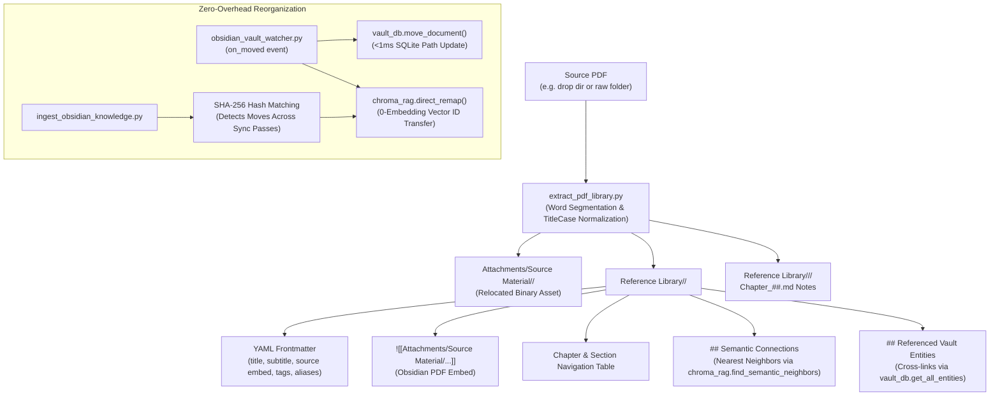

# Evelyn Engine Architecture Map

> Navigation: [[README.md]] · [[endpoints.md]] · [[system_specs.md]] · [[SETUP_GUIDE.md]] · [[ROADMAP.md]] · [[AGENTS.md]]

This document serves as the master structural blueprint of the **Evelyn Engine** ecosystem. It maps every core script, database component, and background service to its functional layer, creating a fully connected knowledge hub for both humans and AI agents.

### Master Documentation & Subsystem Map

| Subsystem Domain | Core Specifications & Guides |
| :--- | :--- |
| **API & Integrations** | [[endpoints.md]] · [[google_access.md]] |
| **Hardware & Environment** | [[system_specs.md]] · [[HPE Server Specs.md]] · [[REQUIREMENTS.md]] · [[SETUP_GUIDE.md]] |
| **Microservices & Vision** | [[REQUIREMENTS_IMAGE_HOST.md]] |
| **Persona & Behavior** | [[System_Directives.md]] · [[Evelyn_Narrative_Persona.md]] · [[Ricky_Narrative_Profile.md]] |
| **Templates & Scaffolding** | [[System_Directives.example.md]] · [[Assistant_Persona.example.md]] · [[User_Profile.example.md]] · [[Physical_Description.example.md]] |
| **Standards & Workflows** | [[AGENTS.md]] · [[.ai-instructions.md]] · [[docstring_guide.md]] · [[quality-review.md]] · [[start-services.md]] · [[debug-chat-db.md]] · [[backup-to-github.md]] |
| **Roadmap & History** | [[ROADMAP.md]] · [[CHANGELOG.md]] · [[ROLLBACK.md]] · [[SUPPORT.md]] |

---

## 1. System Ecosystem & Data Flow

The following Mermaid diagram visualizes the interactive data flow between the user interface, the central FastAPI server, our specialized storage layers, and local AI engines.

```mermaid
graph TD
    User([Tablet / Phone Browser]) <-->|SSE / REST API| Server["[[evelyn_server.py]] (FastAPI Orchestrator)"]
    
    %% Configuration
    Server -.->|Reads Config| Config["[[evelyn_config.py]]"]
    
    %% Storage Layer
    subgraph Storage [Persistent Storage Layer]
        ChatDB[("evelyn_chat.db<br>(SQLite History & GCal Cache)")]
        MemoryDB[("evelyn_memory.db<br>(SQLite Context Entries & Procedures)")]
        VaultDB[("evelyn_vault.db<br>(SQLite Obsidian File Index)")]
        ChromaDB[("chroma_db/<br>(Persistent RAG Vector Index)")]
    end
    
    Server <-->|Query / Insert| ChatDB
    Server <-->|Query / Match| MemoryDB
    Server <-->|Index / Trace| VaultDB
    Server <-->|Semantic Search| ChromaDB

    %% Local & Remote Inference Services
    subgraph LocalAI [Inference & Voice Services]
        subgraph NUMANode0 [NUMA Node 0: Core Engine & GPU]
            Ollama["Ollama API (gemma4:12b thinking LLM)<br>(CPUs 0-23, 48-71 + Tesla T4 GPU)"]
            ChromaDB_Local["ChromaDB Vector Embeddings<br>(BAAI/bge-large-en-v1.5 1024-dim)"]
        end
        subgraph NUMANode1 [NUMA Node 1: Auxiliary Offload]
            TTS["[[tts_server.py]] (FastAPI)<br>(Chatterbox TTS Engine - CPUs 24-47, 72-95)"]
        end
        subgraph RemoteHost [Remote GPU Host: image-host]
            Image["FLUX.1 Schnell Image Host<br>(http://image-host.internal:5055)"]
        end
    end
    
    Server <-->|Prompt / Tool Call| Ollama
    Server -->|Generate Audio| TTS
    Server -->|Generate Visuals (Tailscale)| Image

    %% Knowledge Sync Pipeline
    subgraph Ingestion [Ingestion Pipeline]
        Refresh["[[refresh_memory.py]] (Master Runner)"]
        IngestVault["[[ingest_obsidian_knowledge.py]] (Full-Vault)"]
        VaultIndexer["[[vault_indexer.py]]"]
        SyncFull["[[sync_full_vault_to_chroma.py]] (Reset & Sync)"]
        VaultWatcher["[[obsidian_vault_watcher.py]] (Real-Time Watchdog)"]
    end
    
    Server --->|Trigger Task| Refresh
    Refresh --> IngestVault
    IngestVault --> VaultIndexer
    VaultIndexer <-->|Map Relationships| VaultDB
    IngestVault <-->|Write Context| MemoryDB
    IngestVault <-->|Full-Text Vector Index| ChromaDB
    SyncFull --->|Reset & Re-index| ChromaDB
    VaultWatcher --->|Debounced Trigger| IngestVault
    VaultWatcher --->|Update Metadata| VaultDB
    
    %% Deep Research Subsystem
    subgraph DeepResearch [Deep Research System]
        ResearchEngine["[[research_engine.py]] (Orchestrator)"]
        WebReader["[[web_reader.py]] (Scraper)"]
        Prompts["[[research_prompts.py]] (Templates)"]
        ResearchQueue[("queue.json<br>(Research Queue)")]
    end
    
    Server <-->|Trigger & Monitor| ResearchEngine
    Server <-->|Queue / Dequeue| ResearchQueue
    Ollama <-->|Prompt / Synthesize| ResearchEngine
    ResearchEngine -->|Run Extraction| WebReader
    ResearchEngine -.->|Reads Templates| Prompts
    
    %% External Ecosystem
    subgraph SyncMesh [Multi-Device Syncthing Mesh]
        WinNode["Workstation Node (workstation-pc)"]
        MobileNode["Phone Node (client-phone)"]
        TabNode["Tablet Node (client-tablet)"]
        SyncthingServer["Syncthing Daemon (sanctum:22000)"]
    end
    WinNode <== Tailscale P2P ==> SyncthingServer
    MobileNode <== Tailscale P2P ==> SyncthingServer
    TabNode <== Tailscale P2P ==> SyncthingServer
    SyncthingServer <-->|Sync Files| Obsidian["Obsidian Vault<br>(/home/rathius/obsidian_vault)"]
    Obsidian <-->|Inotify Watch| VaultWatcher
    Obsidian <-->|Read / Sync| IngestVault
    ResearchEngine -->|Save Report| Obsidian

    %% Idle Background Agents
    subgraph IdleAgents [Idle Background Services]
        Extractor["[[fact_extractor.py]] (Fact Ingest)"]
        Consolidator["[[fact_consolidator.py]] (Memory Cleanup)"]
        Evolver["[[profile_evolver.py]] (Persona Evolution)"]
        TagLibrarian["[[tag_librarian.py]] (Tag Audit & Taxonomy)"]
    end


    Server --->|Trigger Idle Run| IdleAgents
    Extractor <-->|Extract Facts & Procedures| ChatDB
    Extractor --->|Write Entry & Procedure| MemoryDB
    Consolidator <-->|Merge / Cleanup| MemoryDB
    Evolver <-->|Scan Context| MemoryDB
    Evolver --->|Propose Update| MemoryDB
    Ollama <-->|LLM Prompts| IdleAgents
```

---

## 2. Core Functional Layers

### 2.1 The Orchestrator
The runtime core that manages user connections, model prompts, memory assembly, and active tool routing.
* **[[evelyn_server.py]]**: Main FastAPI server codebase. Exposes `/chat` (streaming response), `/regenerate` (response regeneration), and `/edit` (`edit_last_user_message()`) endpoints alongside history, status, and system tool APIs. Implements **adaptive day-bound history loading** (`load_history()`: 100% of today's messages + up to 6 from yesterday, bounded by `MAX_HISTORY_MESSAGES`), date-filtered journal isolation, and **dynamic thinking effort** via a multi-tiered architecture: fast pre-classification (`classify_message_effort`), model self-election in Tool Round 0, tool-driven effort escalation (`TOOL_THINK_EFFORT`), and manual UI override. Surfaces normalized phase thinking events (`[Initial]`, `[Tool N]`, `[Response]`) to the UI and permanently records resolved effort and resolution source (`think_effort`, `think_source`) in SQLite `message_metrics`. Loop rounds use a configurable token budget (`TOOL_LOOP_NUM_PREDICT`) distinct from the full response budget.
* **[[evelyn_config.py]]**: Single source of truth config file. Controls LLM parameters, on-demand memory thresholds, allowed Tailscale CORS origins, and system path settings. Key agentic & thinking parameters: `THINK` (default response effort: `"medium"`), `THINK_TOOL_LOOP` (tool round effort: `False` / disabled to prevent duplicate pre-drafting reasoning), `THINK_SELF_ELECT` (enable model effort self-election), `TOOL_LOOP_NUM_PREDICT` (per-round token budget: `1024`), `NUM_PREDICT` (streaming response generation budget: `8192`), `SHOW_TOOL_LOOP_THINKING` (surface intermediate reasoning to UI), `MAX_TOOL_ROUNDS` (loop cap).

### 2.2 Memory & RAG Retrieval Engine
Responsible for semantic vector indexing, context fact assemblies, and exact entity resolutions.
* **[[memory_db.py]]**: SQLite database connector for `evelyn_memory.db`. Manages transactions for context entries and procedural rules. Configured with high-performance PRAGMAs (`WAL` mode, 2 GB `mmap_size`, 64 MB DRAM cache).
* **[[vault_db.py]]**: SQLite database connector for `evelyn_vault.db`. Handles super-fast incremental metadata writes for mapped files.
* **[[chroma_rag.py]]**: ChromaDB semantic search vector index wrapper. Uses **`BAAI/bge-large-en-v1.5`** (1024-dimensional embeddings, 1,600-character chunks with 200 overlap). Performs single-collection vector retrieval across `evelyn_memory`, priority score boosting (`rag_priority: high` multiplier 0.75), and dynamic procedure injection. `evelyn_gists` collection lookups are retired.
* **[[context_manager.py]]**: Mismatch resolver and active context injector. Assembles dense facts, resolves entities, and strips search bloat.
* **[[context_summarizer.py]]**: *(Deprecated)* Previously performed sliding-window context compression. Removed in favor of 40-message active history (`MAX_HISTORY_MESSAGES`) + SQLite `context_entries` + Chroma RAG to eliminate prompt clutter and temporal hallucination bleed in journal generation.
* **[[query_reformulator.py]]**: Sub-pipeline LLM trigger that optimizes conversational keywords before vector lookup, boosting hit rates by 23%.

### 2.3 The Ingestion Pipeline
Initiated on-demand to rebuild, map, and synchronize files from your Obsidian Vault into the local RAG database.
* **[[refresh_memory.py]]**: Master process orchestrator. Triggers vault mapping (`VaultIndexer`) and full-vault knowledge ingestion (`ingest_obsidian_knowledge.py`).
* **[[ingest_obsidian_knowledge.py]]**: Full-vault full-text memory ingestion engine. Recursively scans `/home/rathius/obsidian_vault` (1,202 files), enforcing 1,600-character chunking and automatic `rag_priority: high` for core identity files (`Ricky - Psychological Blueprint.md`, `Evelyn Narrative Persona.md`, `System Directives.md`, `CE_*.md`, `EX_*.md`).
* **[[pdf_staging_worker.py]]**: Automated PDF staging scanner and queue worker. Monitors `Attachments/Staging/Full_Extraction/` and `Attachments/Staging/Sidecar_Only/` to extract multi-chapter literature or generate interactive Sidecar cards under Task Manager mutual exclusion.
* **`ingest_gists.py`**: *(Removed)* Gist summaries and legacy `evelyn_gists` collection have been fully eliminated in favor of direct full-text vector indexing in `evelyn_memory`.
* **[[sync_full_vault_to_chroma.py]]**: Dedicated CLI reset and migration script that purges old vector caches and executes a clean full-vault re-indexing pass.
* **[[vault_indexer.py]]**: Scans directory tree files and generates incremental database relationships (hashes, links, backlinks) inside SQLite.

### 2.4 Deep Research Subsystem
Enables fully autonomous, multi-step search and information synthesis in the background when the server is idle.
* **[[research_engine.py]]**: Core deep research runner. Manages state transitions, confidence scoring, safety brakes, Obsidian Vault compilation, self-initiated gap extraction, auto-rewriting of low-confidence questions, post-synthesis triage loops, local Obsidian note parsing, per-task Chroma vector indexing (for `deep` scope tasks), cross-task Chroma querying leveraging a virtual memory cache, **two-phase prior knowledge necessity pre-filtering** (internal model knowledge & saved memory facts with automatic workspace auto-clearing upon resolution), **pre-search intent mode classification** (`[MODE_TECHNICAL]` vs `[MODE_ACADEMIC]`), **additive source note extraction** (`### Source [src_00X]`) ensuring zero evidence loss, **mid-pipeline native reasoning** (`think=True`) with stage-tailored token budgets, **Research Intent Frame anchoring**, **evaluator gap sanitization** (discarding non-searchable meta-status text), **dynamic technical alias/synonym expansion** (`topic_aliases`), and a **circadian mid-loop window check** that pauses tasks at step boundaries when outside active hours (06:00–21:00).
* **[[web_reader.py]]**: Dynamic web scraper. Features Trafilatura integration, SSL bypasses, timeouts, and adaptive chunking for heavy documents.
* **[[research_prompts.py]]**: Stateless prompt library driving deep search plans, **pre-search intent classification** (`classify_intent_mode`), **intent-calibrated web-native query formulation** (technical mode developer ecosystem targeting vs academic mode consensus targeting, 2–5 keywords, atomic constraints, academic stop-word heuristics), single-source extraction with discovered technical synonyms, alias-aware search rewrites, and 5-part scannable reference guide synthesis with frontmatter `aliases`.

### 2.5 Active Runtime Agents & Tools
Standalone background processes and tools loaded dynamically by the model during chat execution.
* **[[evelyn_tools.py]]**: Definitive tool definitions library containing 22 active model tools (`write_journal_entry`, `generate_image`, `web_search`, `start_research`, `list_research_tasks`, `inspect_research_task`, `guide_research`, `check_new_research`, `search_history`, `create_calendar_event`, `delete_calendar_event`, `sync_google_calendar`, `create_task`, `complete_task`, `delete_task`, `list_tasks`, `sync_google_tasks`, `get_agenda`, `manage_vault_list`, `run_command`, `read_file`, `write_file`). Contains `_log_deprecation()` which logs yellow console warnings and appends full tracebacks to `data/deprecation_warnings.log` whenever deprecated static read tools (`search_vault`, `recall_specific_memory`, `read_journal`) are called out-of-band. Contains `_is_research_engine_running()` — the OS-level PID-based guard against duplicate research subprocess spawning.
* **[[vault_list_manager.py]]**: Obsidian Vault list and checklist manager. Parses markdown files in `cfg.LISTS_DIR`, routing items to categorized headings (`## Produce`, `## Dairy`), incrementing quantities on existing items, toggling checkboxes, and clearing completed items.
* **[[task_manager.py]]**: Centralized heavy task registry. Canonical `is_any_running()`, `set_running()`, and `clear_running()` API used by all heavy task modules. Replaces the 4 separate `_heavy_tasks_running()` copies that previously existed across `fact_extractor`, `fact_consolidator`, `profile_evolver`, and `evelyn_server`. See §5.
* **[[journal_manager.py]]**: Handles journal entry creation, resolution, and roll-ups. Operates via direct UTF-8 file reads and writes across vault root, structured archive (`Journal Entries/YYYY/MM-ShortMonth`), and pending quarantine folders without Obsidian process or CLI dependencies.
* **[[gcal_sync.py]]**: Google Calendar synchronizer. Pulls calendar events and caches them in the SQLite `calendar_events` table, supporting offline-first operations.
* **[[gtasks_sync.py]]**: Google Tasks synchronizer. Pulls to-dos/tasks and caches them in the SQLite `tasks` table, providing CRUD operations and offline-first task querying.
* **[[gdrive_sync.py]]**: Google Drive synchronizer. Periodically syncs and downloads daily Android `Health Connect.zip` exports from Google Drive to maintain local health databases.
* **[[oura_client.py]]**: Oura Ring Cloud API v2 client. Fetches real-time, zero-lag sleep scores, sleep stage hypnograms, readiness scores, and daytime stress indicators.
* **[[health_manager.py]]**: Health and vitals query engine. Blends live Oura Cloud API metrics with local SQLite Health Connect records for comprehensive health intelligence.
* **[[fact_consolidator.py]]**: Idle-time database cleaner and consolidator. Scans context databases for duplicate, compound, or superseded facts. Generates merge, supersede, recategorize, and split/decomposition proposals for bloated compound entries.
* **[[procedure_consolidator.py]]**: Idle-time procedure consolidation engine. Merges overlapping procedural rules into unified specifications.
* **[[profile_evolver.py]]**: Idle-time profile evolver. Scans context entries in the memory database to propose updates to narrative persona, profile, and directives files. Processes large entry sets in **configurable batches** (default 40 entries/pass) to avoid context-window saturation. **Draft persistence**: accumulated working document and cursor are saved to disk after each successful pass so interrupted runs resume from the last completed batch rather than restarting.
* **[[docstring_guide.md]] §7**: Detailed reference containing function indexes, architectural flows, and configuration scopes for the background pipelines.
* **[[terminal_agent.py]]**: Manages shell command execution and file write safety checks, staging operations for user approval and persisting approvals to disk to survive server restarts.
* **[[pending_reviewer.py]]**: CLI dashboard helper for consolidating or deleting staged facts.
* **[[context_reviewer.py]]**: CLI dashboard helper for viewing active context queues.
* **[[undo_thread.py]]**: Interactive debugging script to safely rollback transactions in memory files.

### 2.6 Standalone Inference Services
FastAPI and remote inference services designed to isolate heavy model weights and guarantee zero VRAM resource leakage.
* **[[tts_server.py]]**: Chatterbox (F5-TTS/Matcha) server generating natural expressive speech. Bound to **NUMA Node 1** (`CPUAffinity=24-47 72-95`, `numactl --cpunodebind=1 --membind=1`) with 24 physical cores and 96 GB DRAM isolated on Socket 1.
* **[[image_server.py]]**: FLUX.1 [schnell] server running off-node on a dedicated GPU host over private network (`http://<image-host>.<tailnet>.ts.net:5055`) to leverage workstation GPU resources.

### 2.7 The Frontend User Interface
The presentation and interaction layout loaded by the client browser. Connects directly to server APIs for state management and model inference.

### 2.8 Multimodal Visual Memory & Attachment Ingestion
Handles the end-to-end direct ingestion, metadata extraction, and vector indexing of user-provided media files (images, audio memos, documents).
* **[[media_db.py]]**: Dedicated SQLite interface for `evelyn_media.db`. Manages binary asset storage in `data/attachments/`, SHA-256 deduplication, monotonic prefix GUID generation (`med_img_*`), message junction mapping (`chat_media_links`), and pre-downscale Pillow EXIF/GPS coordinate extraction.
* **[[visual_indexer.py]]**: Asynchronous visual comprehension and taxonomy indexing pipeline. Drains `vision_indexing_queue` during server idle time to extract structured captions, OCR text, domain classifications, and hashtags via local Ollama vision models with user conversational context injection. Enqueues upserts to ChromaDB vector collection `evelyn_media`.

* **`evelyn_ui/index.html`**: The main user-facing dashboard. Renders the interactive companion panel, maintains Tailscale CORS setups, triggers dynamic TTS playback, drives background task polling, and supports in-place user message editing (✏️) and message regeneration (🔄). Implements a full GitHub Flavored Markdown (GFM) renderer using vendored **`marked.js`** and **`DOMPurify`** (`evelyn_ui/vendor/`) with zero Node.js/build-tool dependencies: responsive GFM tables with horizontal scrolling, typography heading hierarchy (`h1`–`h4`), ordered/unordered and interactive task lists (`- [ ]`/`- [x]`), blockquotes, custom YAML frontmatter metadata cards, and fenced code blocks with CSS syntax highlighting and copy-to-clipboard buttons. `renderFullMarkdown` (used for research/journal modals) shares the same unified renderer.
  * *API Bridges*: Communicates via [[endpoints.md]] §1 (streaming prompts), §2 (memory refreshes), and §3 (speech generation).
* **`evelyn_ui/dev.html`**: The developer and review dashboard console. Displays a visual triaging interface for reviewing staged observations, consolidation proposals, and heavy background tasks, powered by the same unified client-side `marked.js` + `DOMPurify` pipeline.
* **`evelyn_ui/vendor/`**: Local client-side JavaScript assets (`marked.min.js`, `purify.min.js`) served statically for 100% offline self-containment.
  * *API Bridges*: Communicates via [[endpoints.md]] §5 (memory triaging) and §6 (research tasks).

### 2.8 The Cognitive Persona & Directives
The standing narrative parameters, constraints, and profile baselines injected dynamically into the model's system prompt at startup.
* **[[Evelyn_Narrative_Persona.md]]**: Core psychological identity and conversational style parameters for Evelyn.
* **[[Ricky_Narrative_Profile.md]]**: User context profile and emotional/cognitive baseline mappings.
* **[[System_Directives.md]]**: Definitive instructions governing tool call behaviors, priority matrices, and interaction boundaries.

---

## 3. Maintenance & Workflow Directives

Evelyn Engine operations are codified inside interactive workflow files:
* **[[start-services.md]]**: Sequential startup steps (Ollama TCP gate → Parallel microservices).
* **[[backup-to-github.md]]**: Protective Git pipeline to keep local personal context files private.
* **[[quality-review.md]]**: Structured engineering checklist to audit and protect system code loops.
* **[[debug-chat-db.md]]**: Inspecting chat history logs and troubleshooting SQLite events.
* **[[update_frontmatter.py]]**: Structural metadata utility running automatically on document edits.
* **[[add_titles.py]]**: Retroactive title block scanner.
* **`evelyn_setup.py`**: Interactive CLI setup and identity configuration wizard for provisioning assistant names, operator names, vault paths, and starter templates.
* **`Evelyn/tools/db_migrator.py`**: Multi-database migration framework with transactional DDL, Python data transform callables, and per-database tracking tables (`schema_migrations`).
* **`scripts/migrate_db.py`**: Standalone CLI migration manager supporting status inspection, execution, dry-runs, and automated Git release tagging.
* **`scripts/migrate_subject_codes.py`**: Strict taxonomy migration utility converting database context entries and proposals from `-R`/`-E` to `-U`/`-A`.
* **`scripts/extract_pdf_library.py`**: High-fidelity PDF extraction engine featuring PyMuPDF section hierarchy detection, DP title segmentation, dynamic zero-padded chapter generation, Sidecar Index Card synthesis, and nearest-neighbor vector RAG cross-linking.
* **`scripts/relocate_vault_pdfs.py`**: Vault attachment normalization utility migrating non-markdown documents to `Attachments/Source Material/<Domain>/` while creating interactive Sidecar Note viewers.
* **`scripts/sqlite_mcp_server.py`**: High-performance Model Context Protocol (MCP) server exposing read-only SQLite tools (`chat`, `memory`, `vault`, `media`, `health`), ChromaDB vector operations, and FastAPI/Ollama service telemetry to AI developer agents.
* **`scripts/trigger_profile_evolution.py`**: Manual one-shot trigger for profile evolution. Bypasses the idle-time threshold and heavy-task mutex — safe to run while the server is up. Respects the same draft-resume logic as the idle loop.
* **`scripts/audit_vault_tags.py`**: Standalone CLI batch taxonomy audit runner prioritizing un-audited notes by urgency (missing tags, multi-dash compound tags, flat tags) with live progress telemetry and interruptibility.
* **`templates/`**: Generic persona, profile, directive, and physical description example templates for open-source distributions.

---

## 4. Related Workspace Paths & Integrations

The Evelyn ecosystem operates in tandem with external environments and local system processes. Paths are derived dynamically from `BASE_DIR` in `evelyn_config.py`:

### 4.1 Development Workspaces
* **Evelyn Root (`BASE_DIR`)**: `.` (Repository root containing server, config, and web UI)
* **Evelyn Tools (`TOOLS_DIR`)**: `Evelyn/tools` (Sub-pipelines and executable runtime actions)
* **Scripts / Automation**: `scripts/` (General utility and maintenance tools)

### 4.2 Resource & Data Directories
* **Obsidian Vault Base (`VAULT_BASE_DIR`)**: `~/obsidian_vault` (Core vault hosting personal knowledge bases, prompts, and notes)
* **SQLite Data Base (`DATA_DIR`)**: `data/` (Persistent databases: `chat`, `memory`, `vault`, `media`, `health`, Chroma vectors, and backups)
* **Ollama Data**: `~/.ollama/models` (Local model weights and parameters)

---

## 5. Background Task Mutual Exclusion Standard

> [!IMPORTANT]
> **CRITICAL ARCHITECTURAL DIRECTIVE — UNIFIED MUTUAL EXCLUSION**
> To avoid Ollama VRAM/GPU thrashing, SQLite database locks, and overall CPU resource contention, **NO TWO HEAVY BACKGROUND TASKS MAY RUN SIMULTANEOUSLY.**
>
> All background operations (syncing, indexing, extracting, consolidating, or research) MUST be coordinated through the unified registry standard described below.

### 5.1 Primary Mechanism — `task_manager.py`

**`Evelyn/tools/task_manager.py`** is the single canonical source of truth for all heavy task mutual exclusion. It was introduced (2026-08-01) to replace 4 separate, drift-prone copies of `_heavy_tasks_running()` that previously existed across modules.

| Function | Purpose |
|---|---|
| `task_manager.is_any_running(exclude=None)` | Authoritative check — returns `True` if any other heavy task is active |
| `task_manager.set_running(name, task_obj=None)` | Register a task as running in central dict and store backing Python handle |
| `task_manager.clear_running(name)` | Deregister a task and log runtime metrics to SQLite `heavy_task_history` table |
| `task_manager.get_status(name)` | Read current status of a named task |
| `task_manager.start_watchdog(interval=30.0)` | Start 30s background loop for handle reconciliation & dynamic soft-timeouts |
| `task_manager.get_dynamic_timeout(name)` | Calculate dynamic soft-timeout threshold using historical statistics ($\mu + 3\sigma$) |
| `task_manager.enqueue_idle_task(task_name, ...)` | Enqueue a task at the tail of the persistent FIFO idle queue |
| `task_manager.acquire_next_idle_task()` | Pop and return the next runnable task from the front of the FIFO queue |
| `task_manager.should_yield(task_name)` | Cooperative yield check — returns `True` if peer tasks are queued or chat is active |
| `task_manager.set_chat_preemption(bool)` | Set/clear chat preemption flag and cancel active idle tasks for zero-delay inference |
| `task_manager.load_persistent_queue()` | Reconcile disk queue on boot and restore interrupted running tasks to the front |

**How it works:** `task_manager` coordinates mutual exclusion, fair scheduling, and cooperative batching across all background processes. It maintains a persistent FIFO idle queue (`data/evelyn_task_queue.json`) ensuring long backlogs (e.g. 20k+ chat messages for `fact_extractor`) drain continuously without starving peer tasks (`tag_librarian`, `consolidator`, `profile_evolver`). After each batch, tools commit their progress to SQLite and call `should_yield()`; if peer tasks are waiting, the tool re-enqueues at the tail and yields. When user chats begin, `set_chat_preemption(True)` instantly preempts idle tasks to give 100% compute to conversation turns. Interrupted running tasks on reboot are placed at the front of the queue to resume seamlessly after a 60s boot grace period (`IDLE_STARTUP_GRACE_PERIOD`).

### 5.2 Mandatory Rules for All Heavy Tasks

1. **Central Source of Truth**: `_background_tasks` dict in `evelyn_server.py` remains the registry. `task_manager` reads and writes it.
2. **Authoritative Checker**: Call `task_manager.is_any_running(exclude="<your_task_name>")` — do NOT re-implement the check inline.
3. **Active Registration**: Any heavy operation MUST call `task_manager.set_running(name)` at startup and `task_manager.clear_running(name)` in its `finally` block. For `asyncio` tasks, this is done via `_set_status_in_server()` which delegates to `task_manager`. For subprocess tasks (research), the server's idle loop handles registration.
4. **No Private Copies**: Do not add a new module-local `_heavy_tasks_running()`. Add the task key to `task_manager.HEAVY_TASK_KEYS` and use the shared API.

### 5.3 Research Subprocess Hardening Layers (2026-08-01)

The research engine (`research_engine.py`) runs as a subprocess, not an asyncio coroutine, which requires additional OS-level hardening beyond the in-memory registry:

| Layer | Mechanism | Location |
|---|---|---|
| **L1 — PID Lock** | `engine.pid` written at subprocess start, checked before any `Popen` call | `research_engine.py: _write_pid_lock()/_release_pid_lock()`, `evelyn_tools.py: _is_research_engine_running()` |
| **L2 — Spawn Debounce** | 60-second quiet period after any spawn; prevents 10s idle loop from firing twice | `evelyn_server.py: _last_research_spawn_ts` |
| **L3 — Error Cooldown** | 10-minute backoff before auto-resuming a task with `status=="error"` | `evelyn_server.py: _error_resume_ts` |
| **L4 — Orphan Detection** | On server startup, `engine.pid` is checked per task to distinguish live orphans from clean restarts | `evelyn_server.py: _load_existing_research_tasks()` |

### 5.4 Known Heavy Tasks

| Task Key | Module | Type |
|---|---|---|
| `task_<id>` | `research_engine.py` | subprocess |
| `extractor` | `fact_extractor.py` | asyncio coroutine |
| `consolidator` | `fact_consolidator.py` | asyncio coroutine |
| `procedure_consolidator` | `procedure_consolidator.py` | asyncio coroutine |
| `profile_evolver` | `profile_evolver.py` | asyncio coroutine |
| `refresh_memory` | `evelyn_server.py` | asyncio subprocess |
| `sync` | `evelyn_server.py` | daemon thread |
| `vault_map` | `evelyn_server.py` | daemon thread |
| `tag_librarian` | `tag_librarian.py` | asyncio coroutine |

> [!CAUTION]
> *Any deviation from this unified coordination architecture is STRICTLY PROHIBITED. Adding a new heavy task without routing it through `task_manager` is a bug, not a feature. New tasks must: (1) call `task_manager.set_running()` at start, (2) call `task_manager.clear_running()` in `finally`, (3) check `task_manager.is_any_running()` before beginning work.*

---

## 6. NUMA Topology & Server Performance Tuning

The HPE ProLiant DL360 Gen10 server (*Sanctum*) features a **Dual-Socket Intel Xeon Gold 5220R** architecture (48 Cores / 96 Threads, 192 GB DDR4 RAM). The system is partitioned into two distinct NUMA domains to maximize throughput and eliminate Ultra Path Interconnect (UPI) cross-socket memory latency:

```
+-----------------------------------------------------------------------------------+
|                            HPE ProLiant DL360 Gen10 (Sanctum)                     |
+--------------------------------------------------+--------------------------------+
|                   NUMA Node 0                    |           NUMA Node 1          |
|             (Cores 0-23 / Threads 0-23, 48-71)    | (Cores 24-47 / Threads 24-47,  |
|                     96 GB DRAM                   |            72-95)              |
|          PCIe Slot 1: NVIDIA Tesla T4 16GB        |           96 GB DRAM           |
+--------------------------------------------------+--------------------------------+
|  Services:                                       |  Services:                     |
|   • ollama.service (gemma4:12b LLM)              |   • evelyn-tts.service         |
|   • evelyn.service (FastAPI Core Engine)         |     (Chatterbox TTS)           |
|   • ChromaDB ONNX Vector Index                   |   • Batch Data Ingestion       |
|   • SQLite History / Vault / Memory Databases    |     (extract_pdf_library.py)   |
+--------------------------------------------------+--------------------------------+
```

### 6.1 NUMA Pinning Rules
1. **Unified Core Engine (NUMA Node 0)**:
   - `ollama.service` and `evelyn.service` are explicitly pinned to **CPUs 0-23, 48-71** via `CPUAffinity=0-23 48-71` and `numactl --cpunodebind=0 --membind=0`.
   - Keeps all GPU DMA transfers (Tesla T4 on PCIe Slot 1), PyTorch CUDA buffers, ONNX vector embeddings, and SQLite database IO local to Socket 0 DRAM.
2. **Auxiliary Offloading (NUMA Node 1)**:
   - `evelyn-tts.service` is pinned to **CPUs 24-47, 72-95** via `CPUAffinity=24-47 72-95` and `numactl --cpunodebind=1 --membind=1`.
   - Voice generation runs with 24 dedicated physical cores without taking CPU cycles or memory bandwidth from LLM chat.
3. **Thread Pool Limits**:
   - Environment variables (`OMP_NUM_THREADS=16/24`, `MKL_NUM_THREADS=16`, `OPENBLAS_NUM_THREADS=16`, `ONNXRUNTIME_NUM_THREADS=16`, `KMP_AFFINITY=granularity=fine,compact,1,0`) bound OpenMP/MKL thread pools within single sockets, preventing 96-thread unpinned CPU thrashing.

---

## 7. Chroma Single-Writer Staging Queue & Lifecycle Architecture

To eliminate vector index corruption and cross-process Rust/C++ HNSW segment file-lock collisions in a multi-process environment, all writes to ChromaDB are serialized through a SQLite WAL-backed staging queue.

```mermaid
graph TD
    subgraph Producers [Concurrent Write Producers]
        Watcher["[[obsidian_vault_watcher.py]]"]
        Extractor["[[fact_extractor.py]]"]
        Consolidator["[[fact_consolidator.py]]"]
        Splitter["Context Splitter"]
        Librarian["[[tag_librarian.py]]"]
        Ingest["[[ingest_obsidian_knowledge.py]]"]
    end

    subgraph StagingQueue [SQLite WAL Staging Layer]
        QueueTable[("evelyn_memory.db<br>chroma_sync_queue")]
    end

    subgraph SingleCustodian [Persistent Single Custodian]
        Server["[[evelyn_server.py]]<br>(PersistentClient Singleton)"]
        DrainWorker["Queue Drain Loop<br>(interval=1.5s, batch=50)"]
        HealthProbe["Canary Health Probe<br>(Startup Vector Probe)"]
        StartupReaper["Process & Lock Reaper<br>(Startup Sanitation)"]
        ChromaStore[("chroma_db/<br>Unified Vector Store")]
    end

    Producers -->|enqueue_upsert / enqueue_delete<br>(Non-blocking SQLite WAL Insert)| QueueTable
    Server --> StartupReaper
    Server --> HealthProbe
    Server --> DrainWorker
    DrainWorker <-->|Drain Batch & Mark Done / Error| QueueTable
    DrainWorker -->|direct_upsert / direct_delete| ChromaStore
```

### 7.1 Key Architectural Guarantees
---

## 8. Vault Maintenance, Sidecar Index Cards & Zero-Overhead Reorganization

To make non-markdown documents (PDFs, media) first-class nodes in Obsidian's knowledge graph without creating massive hub notes or redundant ingestion passes:



### 8.1 Architectural Guarantees
1. **Dynamic Programming Title Normalization**: Converts unspaced or concatenated filenames into clean Title Case and subtitle metadata, applying custom maps for technical terminology (`AI`, `ML`, `PyTorch`, `Scikit-Learn`, `Multi-Agent`).
2. **First-Class Sidecar Index Cards**: Each non-markdown document receives a dedicated `.md` note that embeds the binary asset from `Attachments/Source Material/<Domain>/` and provides structured TOCs, summary gists, nearest-neighbor semantic connections, and referenced vault entities.
3. **Zero-Embedding Path Remapping**: Moving or reorganizing notes across vault directories executes atomic path updates in `vault_documents` ($<1\text{ms}$) and transfers precomputed vector chunks in ChromaDB without running GPU/CPU embedding inference.
