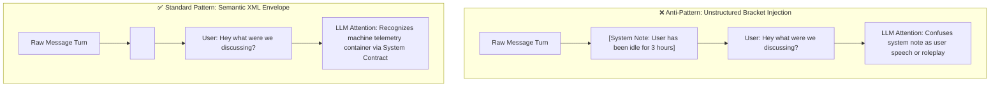

# In-Flight Context Injection via Structured XML Envelopes

> Navigation: [[README.md]] · [[AGENTS.md]] · [[engine_architecture.md]] · [[docstring_guide.md]]

> [!ABSTRACT]
> **Executive Summary**  
> This specification defines the structural standard for injecting dynamic runtime telemetry, temporal context, retrieved knowledge chunks (RAG), and autonomous event notifications into Evelyn LLM prompts. By replacing unstructured bracket annotations (`[System Note: ...]`) with semantic XML envelopes, the engine completely eliminates role bleeding and establishes unambiguous boundaries between machine telemetry and user dialogue.

---

## 1. 🪐 Problem Statement & The "Role Bleeding" Failure Mode

When background workers, schedulers, or context managers inject dynamic metadata into conversation turns on the fly, using plain text annotations—such as bracketed comments (`[System Note: ...]`), parenthetical asides, or unstructured prefixes—frequently causes **role bleeding**.

LLM tokenizers and attention mechanisms do not treat arbitrary brackets or markdown bolding as structural barriers. The model often parses these notes as conversational dialogue, roleplay stage directions, or text authored directly by the operator.



### Comparative Analysis

| Dimension | Unstructured Plain Text (`[...]`) | Semantic XML Envelopes (`<tag>...</tag>`) |
| :--- | :--- | :--- |
| **Tokenizer Treatment** | Generic text tokens; identical attention weighting to user speech. | Recognized as structured code/markup blocks by modern foundation models. |
| **Role Separation** | High risk of the LLM attributing machine notes to the user persona. | Absolute structural boundary isolating telemetry from user content. |
| **Attribute Parsing** | Fragile regex string extraction required for telemetry fields. | Clean attribute-value pairs (`status="resumed" idle_duration="3h"`). |
| **Token Efficiency** | Verbose natural language preambles. | Compact, predictable markup with zero empty tags. |
| **Sanitization & Safety** | Prone to prompt injection if user repeats bracket patterns. | Deterministic escaping and closed tag boundary validation. |

---

## 2. 🧱 Core Engineering Conventions

1. **Explicit Snake_Case Tag Names**: Use descriptive tag names that clarify data origin and type (e.g. `<temporal_context>`, `<context_retrieval>`, `<autonomous_trigger>`).
2. **Attributes for Metadata, Elements for Payloads**:
   - Use XML attributes for states, identifiers, scores, timestamps, and counts.
   - Use element bodies for natural language excerpts and summary text.
3. **Token Pruning (No Empty Envelopes)**: Never emit empty containers. If a background check produces no active updates (e.g. no overdue tasks or retrieved facts), omit the tag entirely.
4. **Turn Boundary Placement**:
   - **Preferred (Multi-Turn Chat Arrays)**: Inject the XML envelope as an isolated `system` or `developer` role turn immediately preceding the user turn.
   - **Fallback (Strict Alternating Turns / Raw Concatenation)**: Prepend the XML envelope to the `user` turn separated by two newlines (`\n\n`), ensuring user text resides strictly outside tag boundaries.

---

## 3. 🏷️ Canonical Tag Taxonomy

Engine components and background workers must use standardized tag names to prevent prompt fragmentation and enable consistent downstream parsing:

| Tag Name | Purpose | Primary Attributes | Body Content |
| :--- | :--- | :--- | :--- |
| `<temporal_context>` | Current timestamp, timezone, and session idle gap. | `status`, `idle_duration`, `last_interaction` | `<current_time>` child tag |
| `<context_retrieval>` | RAG search results from Obsidian vault or ChromaDB. | `source`, `match_count` | `<document id="..." score="...">` child tags |
| `<autonomous_trigger>` | Proactive scheduler events, task notifications, or alarms. | `type`, `entity_id`, `severity` | `<summary>`, `<directive>` child tags |
| `<system_event>` | Runtime telemetry, tool execution outcomes, or daemon status. | `event`, `timestamp`, `status` | Human-readable event description |
| `<memory_context>` | Fast memory facts injected from `evelyn_memory.db`. | `category`, `subject` | Extracted fact / observation statement |

---

## 4. 📜 Standard Implementation Examples

### A. Temporal & Session Telemetry

```xml
<temporal_context>
  <current_time>Saturday, Aug 29, 2026, 11:37 AM CDT</current_time>
  <session_gap status="resumed" idle_duration="3h 15m" last_interaction="2026-08-29 08:22 AM" />
</temporal_context>
```

### B. Retrieved Knowledge / Vector Search (RAG)

```xml
<context_retrieval source="vault" match_count="1">
  <document id="Hardware/Power/Solar.md" score="0.89">
    Output voltage peaks at 24V under optimal sunlight conditions. Charging controller cuts off at 28.4V.
  </document>
</context_retrieval>
```

### C. Autonomous Background Triggers

```xml
<autonomous_trigger type="task_overdue" entity_id="task_441" severity="medium">
  <summary>Task 'Inspect server backup' is overdue by 15m.</summary>
  <directive>Evaluate urgency and notify operator if appropriate.</directive>
</autonomous_trigger>
```

### D. Extracted Memory Facts

```xml
<memory_context category="Cat01-U" subject="Ricky">
  Operator prefers concise terminal commands with JSON output formatting.
</memory_context>
```

---

## 5. 🛡️ The System Prompt Contract

Structured XML injection operates reliably only when the base persona system instructions define an explicit parsing contract. Any prompt pipeline utilizing XML envelopes must include this contract in the base system instructions:

> [!IMPORTANT]
> **System Telemetry & Metadata Contract:**  
> Text enclosed in XML tags (e.g. `<temporal_context>`, `<system_event>`, `<context_retrieval>`, `<autonomous_trigger>`) represents environmental telemetry generated automatically by the server runtime.
> 1. **Do not attribute this text to the user.**
> 2. **Use this data purely as background awareness and contextual ground truth.**
> 3. **Do not echo, recite, or reference raw XML tags in conversational responses.**

---

## 6. ⚡ Rules for Engine Developers & Agents

1. **Sanitize & Escape User Content**: Never interpolate unescaped user-controlled text directly into XML tag bodies or attributes. Always sanitize stray `</tag>` occurrences or XML entity delimiters (`&`, `<`, `>`).
2. **Never Mix Telemetry & Dialogue In-Line**: When appending to a user turn, the XML envelope must sit strictly at the very top, separated by double newlines (`\n\n`). Never embed XML tags mid-sentence inside user speech.
3. **Deterministic Tag Naming**: Always use approved taxonomy tags. Do not invent one-off ad-hoc tag names without documenting them in this reference.
4. **Use Canonical Helper Functions**: When XML formatting utilities are available in `Evelyn/tools/string_utils.py`, always import and reuse them rather than writing inline string concatenation routines.

---

## 🔗 Related Notes
- [[AGENTS.md]] — Section 9: In-Flight Context Injection & XML Envelopes
- [[engine_architecture.md]] — Context management, sliding window memory, and RAG pipelines
- [[docstring_guide.md]] — Documentation and docstring standards
- [[endpoints.md]] — Chat and streaming API contracts
